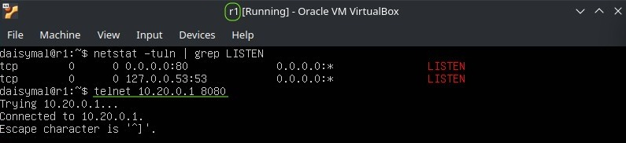
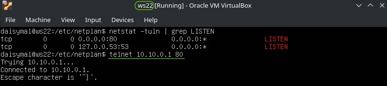
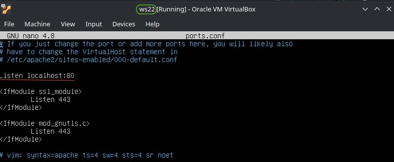
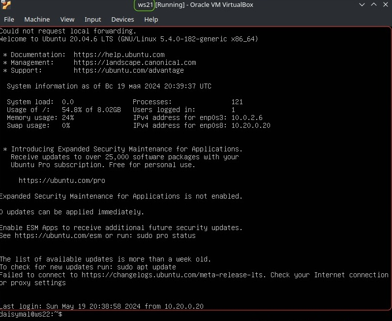
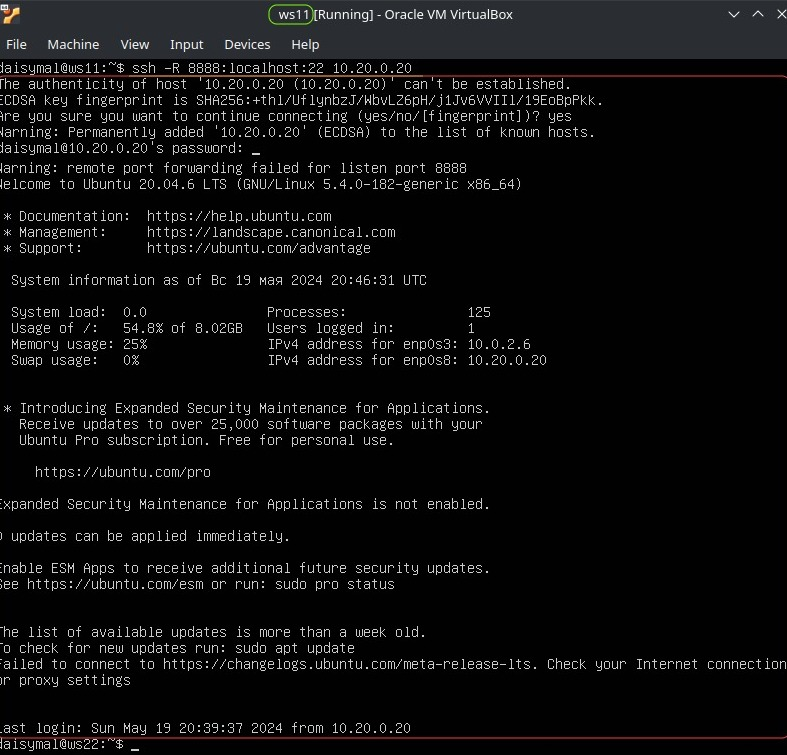
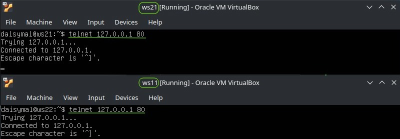

## Contents

   Part 1. [Инструмент ipcalc](#part-1-инструмент-ipcalc)  
   Part 2. [Статическая маршрутизация между двумя машинами](#part-2-статическая-маршрутизация-между-двумя-машинами)  
   Part 3. [Утилита iperf3](#part-3-утилита-iperf3)  
   Part 4. [Сетевой экран](#part-4-сетевой-экран)  
   Part 5. [Статическая маршрутизация сети](#part-5-статическая-маршрутизация-сети)  
   Part 6. [Динамическая настройка IP с помощью DHCP](#part-6-динамическая-настройка-ip-с-помощью-dhcp)  
   Part 7. [NAT](#part-7-nat)  
   Part 8. [Допополнительно. Знакомство с SSH Tunnels](#part-8-дополнительно-знакомство-с-ssh-tunnels)  


## Part 1. Инструмент **ipcalc**

##### Подними виртуальную машину (далее -- ws1)

#### 1.1. Сети и маски
##### Определи и запиши в отчёт:
##### 1) Адрес сети *192.167.38.54/13*


##### 2) Перевод маски *255.255.255.0* в префиксную и двоичную запись, */15* в обычную и двоичную, *11111111.11111111.11111111.11110000* в обычную и префиксную


##### 3) Минимальный и максимальный хост в сети *12.167.38.4* при масках: */8*, *11111111.11111111.00000000.00000000*, *255.255.254.0* и */4*


#### 1.2. localhost
##### Определи и запиши в отчёт, можно ли обратиться к приложению, работающему на localhost, со следующими IP: *194.34.23.100*, *127.0.0.2*, *127.1.0.1*, *128.0.0.1*


Возможно для следующих ip-адресов: 127.0.0.2, 127.1.0.1.

#### 1.3. Диапазоны и сегменты сетей
##### Определи и запиши в отчёт:
##### 1) Какие из перечисленных IP можно использовать в качестве публичного, а какие только в качестве частных: *10.0.0.45*, *134.43.0.2*, *192.168.4.2*, *172.20.250.4*, *172.0.2.1*, *192.172.0.1*, *172.68.0.2*, *172.16.255.255*, *10.10.10.10*, *192.169.168.1*


##### 2) Какие из перечисленных IP адресов шлюза возможны у сети *10.10.0.0/18*: *10.0.0.1*, *10.10.0.2*, *10.10.10.10*, *10.10.100.1*, *10.10.1.255*


Возможные адреса шлюза - 10.10.0.2, 10.10.10.10, 10.10.1.255.

## Part 2. Статическая маршрутизация между двумя машинами

##### Подними две виртуальные машины (далее -- ws1 и ws2).

##### С помощью команды `ip a` посмотри существующие сетевые интерфейсы.
- В отчёт помести скрин с вызовом и выводом использованной команды.


##### Опиши сетевой интерфейс, соответствующий внутренней сети, на обеих машинах и задать следующие адреса и маски: ws1 - *192.168.100.10*, маска */16*, ws2 - *172.24.116.8*, маска */12*.


- В отчёт помести скрины с содержанием изменённого файла *etc/netplan/00-installer-config.yaml* для каждой машины.


##### Выполни команду `netplan apply` для перезапуска сервиса сети.
- В отчёт помести скрин с вызовом и выводом использованной команды.


#### 2.1. Добавление статического маршрута вручную
##### Добавь статический маршрут от одной машины до другой и обратно при помощи команды вида `ip r add`.
##### Пропингуй соединение между машинами.
- В отчёт помести скрин с вызовом и выводом использованных команд.


#### 2.2. Добавление статического маршрута с сохранением
##### Перезапусти машины.
##### Добавь статический маршрут от одной машины до другой с помощью файла *etc/netplan/00-installer-config.yaml*.
- В отчёт помести скрин с содержанием изменённого файла *etc/netplan/00-installer-config.yaml*.


##### Пропингуй соединение между машинами.
- В отчёт помести скрин с вызовом и выводом использованной команды.


## Part 3. Утилита **iperf3**

*В данном задании используются виртуальные машины ws1 и ws2 из Части 2*

#### 3.1. Скорость соединения
##### Переведи и запиши в отчёт: 8 Mbps в MB/s, 100 MB/s в Kbps, 1 Gbps в Mbps.

8   Mbps  =  1      MB/s  
100 MB/s  =  800000 Kbps  
1   Gbps  =  1000   Mbps  

#### 3.2. Утилита **iperf3**
##### Измерь скорость соединения между ws1 и ws2.
- В отчёт помести скрины с вызовом и выводом использованных команд.


## Part 4. Сетевой экран

*В данном задании используются виртуальные машины ws1 и ws2 из Части 2*

#### 4.1. Утилита **iptables**
##### Создай файл */etc/firewall.sh*, имитирующий фаерволл, на ws1 и ws2:
```shell
#!/bin/sh

# Удаление всех правил в таблице «filter» (по-умолчанию).
iptables -F
iptables -X
```
##### Нужно добавить в файл подряд следующие правила:
##### 1) На ws1 примени стратегию, когда в начале пишется запрещающее правило, а в конце пишется разрешающее правило (это касается пунктов 4 и 5).
##### 2) На ws2 примени стратегию, когда в начале пишется разрешающее правило, а в конце пишется запрещающее правило (это касается пунктов 4 и 5).
##### 3) Открой на машинах доступ для порта 22 (ssh) и порта 80 (http).
##### 4) Запрети *echo reply* (машина не должна «пинговаться», т.е. должна быть блокировка на OUTPUT).
##### 5) Разреши *echo reply* (машина должна «пинговаться»).
- В отчёт помести скрины с содержанием файла */etc/firewall* для каждой машины.


##### Запусти файлы на обеих машинах командами `chmod +x /etc/firewall.sh` и `/etc/firewall.sh`.
- В отчёт помести скрины с запуском обоих файлов;
- В отчёте опиши разницу между стратегиями, применёнными в первом и втором файлах.


#### 4.2. Утилита **nmap**
##### Командой **ping** найди машину, которая не «пингуется», после чего утилитой **nmap** покажи, что хост машины запущен.
*Проверка: в выводе nmap должно быть сказано: `Host is up`*.
- В отчёт помести скрины с вызовом и выводом использованных команд **ping** и **nmap**.


##### Сохрани дампы образов виртуальных машин
**P.S. Ни в коем случае не сохраняй дампы в гит!**

## Part 5. Статическая маршрутизация сети

Сеть: \


##### Подними пять виртуальных машин (3 рабочие станции (ws11, ws21, ws22) и 2 роутера (r1, r2)).

#### 5.1. Настройка адресов машин
##### Настрой конфигурации машин в *etc/netplan/00-installer-config.yaml* согласно сети на рисунке.
- В отчёт помести скрины с содержанием файла *etc/netplan/00-installer-config.yaml* для каждой машины.


##### Перезапусти сервис сети. Если ошибок нет, то командой `ip -4 a` проверь, что адрес машины задан верно. Также пропингуй ws22 с ws21. Аналогично пропингуй r1 с ws11.
- В отчёт помести скрины с вызовом и выводом использованных команд.


#### 5.2. Включение переадресации IP-адресов
##### Для включения переадресации IP, выполни команду на роутерах:
`sysctl -w net.ipv4.ip_forward=1`
*При таком подходе переадресация не будет работать после перезагрузки системы.*
- В отчёт помести скрин с вызовом и выводом использованной команды.


##### Открой файл */etc/sysctl.conf* и добавь в него следующую строку:
`net.ipv4.ip_forward = 1`

*При использовании этого подхода, IP-переадресация включена на постоянной основе.*
- В отчёт помести скрин с содержанием изменённого файла */etc/sysctl.conf*.


#### 5.3. Установка маршрута по-умолчанию
Пример вывода команды `ip r` после добавления шлюза:
```
default via 10.10.0.1 dev eth0
10.10.0.0/18 dev eth0 proto kernel scope link src 10.10.0.2
```
##### Настрой маршрут по-умолчанию (шлюз) для рабочих станций. Для этого добавь `default` перед IP роутера в файле конфигураций.
- В отчёт помести скрин с содержанием файла *etc/netplan/00-installer-config.yaml*;


##### Вызови `ip r` и покажи, что добавился маршрут в таблицу маршрутизации.
- В отчёт помести скрин с вызовом и выводом использованной команды.


##### Пропингуй с ws11 роутер r2 и покажи на r2, что пинг доходит. Для этого используй команду:
`tcpdump -tn -i eth0`
- В отчёт помести скрин с вызовом и выводом использованных команд.


#### 5.4. Добавление статических маршрутов
##### Добавь в роутеры r1 и r2 статические маршруты в файле конфигураций. Пример для r1 маршрута в сетку 10.20.0.0/26:
```shell
# Добавь в конец описания сетевого интерфейса eth1:
- to: 10.20.0.0
  via: 10.100.0.12
```
- В отчёт помести скрины с содержанием изменённого файла *etc/netplan/00-installer-config.yaml* для каждого роутера.


##### Вызови `ip r` и покажи таблицы с маршрутами на обоих роутерах. Пример таблицы на r1:
```
10.100.0.0/16 dev eth1 proto kernel scope link src 10.100.0.11
10.20.0.0/26 via 10.100.0.12 dev eth1
10.10.0.0/18 dev eth0 proto kernel scope link src 10.10.0.1
```
- В отчёт помести скрин с вызовом и выводом использованной команды.


##### Запусти команды на ws11:
`ip r list 10.10.0.0/[маска сети]` и `ip r list 0.0.0.0/0`
- В отчёт помести скрин с вызовом и выводом использованных команд;


- В отчёте объясни, почему для адреса 10.10.0.0/\[маска сети\] был выбран маршрут, отличный от 0.0.0.0/0, хотя он попадает под маршрут по-умолчанию.

Возможно, существует более точный маршрут, который соответствует адресу 10.10.0.0/[порт сети], чем маршрут по умолчанию 0.0.0.0/0.
Маршрутизаторы выбирают наилучший маршрут на основе наиболее специфичных совпадений адресов в маршрутной таблице. Если есть маршрут, который наиболее точно соответствует адресу назначения, он будет использован вместо маршрута по умолчанию.

#### 5.5. Построение списка маршрутизаторов
Пример вывода утилиты **traceroute** после добавления шлюза:
```
1 10.10.0.1 0 ms 1 ms 0 ms
2 10.100.0.12 1 ms 0 ms 1 ms
3 10.20.0.10 12 ms 1 ms 3 ms
```
##### Запусти на r1 команду дампа:
`tcpdump -tnv -i eth0`
##### При помощи утилиты **traceroute** построй список маршрутизаторов на пути от ws11 до ws21.
- В отчёт помести скрины с вызовом и выводом использованных команд (tcpdump и traceroute);


- В отчёте, опираясь на вывод, полученный из дампа на r1, объясни принцип работы построения пути при помощи **traceroute**.

Команда traceroute linux использует UDP пакеты. Она отправляет пакет с TTL=1 и смотрит адрес ответившего узла, дальше TTL=2, TTL=3 и так пока не достигнет цели. Каждый раз отправляется по три пакета и для каждого из них измеряется время прохождения. Когда утилита traceroute получает сообщение от целевого узла о том, что порт недоступен трассировка считается завершенной.

#### 5.6. Использование протокола **ICMP** при маршрутизации
##### Запусти на r1 перехват сетевого трафика, проходящего через eth0 с помощью команды:
`tcpdump -n -i eth0 icmp`
##### Пропингуй с ws11 несуществующий IP (например, *10.30.0.111*) с помощью команды:
`ping -c 1 10.30.0.111`
- В отчёт помести скрин с вызовом и выводом использованных команд.


##### Сохрани дампы образов виртуальных машин.
**P.S. Ни в коем случае не сохраняй дампы в гит!**

## Part 6. Динамическая настройка IP с помощью **DHCP**

*В данном задании используются виртуальные машины из Части 5.*

##### Для r2 настрой в файле */etc/dhcp/dhcpd.conf* конфигурацию службы **DHCP**:
##### 1) Укажи адрес маршрутизатора по-умолчанию, DNS-сервер и адрес внутренней сети. Пример файла для r2:
```shell
subnet 10.100.0.0 netmask 255.255.0.0 {}

subnet 10.20.0.0 netmask 255.255.255.192
{
    range 10.20.0.2 10.20.0.50;
    option routers 10.20.0.1;
    option domain-name-servers 10.20.0.1;
}
```


##### 2) В файле *resolv.conf* пропиши `nameserver 8.8.8.8`.
- В отчёт помести скрины с содержанием изменённых файлов.


##### Перезагрузи службу **DHCP** командой `systemctl restart isc-dhcp-server`. Машину ws21 перезагрузи при помощи `reboot` и через `ip a` покажи, что она получила адрес. Также пропингуй ws22 с ws21.
- В отчёт помести скрины с вызовом и выводом использованных команд.


##### Укажи MAC адрес у ws11, для этого в *etc/netplan/00-installer-config.yaml* надо добавить строки: `macaddress: 10:10:10:10:10:BA`, `dhcp4: true`.
- В отчёт помести скрин с содержанием изменённого файла *etc/netplan/00-installer-config.yaml*.


##### Для r1 настрой аналогично r2, но сделай выдачу адресов с жесткой привязкой к MAC-адресу (ws11). Проведи аналогичные тесты.
- В отчёте этот пункт опиши аналогично настройке для r2.


##### Запроси с ws21 обновление ip адреса.
- В отчёте помести скрины ip до и после обновления.


- В отчёте опиши, какими опциями **DHCP** сервера пользовался в данном пункте.

dhclient -r, dhclient -v

##### Сохрани дампы образов виртуальных машин.
**P.S. Ни в коем случае не сохраняй дампы в гит!**

## Part 7. **NAT**

*В данном задании используются виртуальные машины из Части 5.*
##### В файле */etc/apache2/ports.conf* на ws22 и r1 измени строку `Listen 80` на `Listen 0.0.0.0:80`, то есть сделай сервер Apache2 общедоступным.
- В отчёт помести скрин с содержанием изменённого файла.


##### Запусти веб-сервер Apache командой `service apache2 start` на ws22 и r1.
- В отчёт помести скрины с вызовом и выводом использованной команды.


##### Добавь в фаервол, созданный по аналогии с фаерволом из Части 4, на r2 следующие правила:
##### 1) Удаление правил в таблице filter - `iptables -F`;
##### 2) Удаление правил в таблице "NAT" - `iptables -F -t nat`;
##### 3) Отбрасывать все маршрутизируемые пакеты - `iptables --policy FORWARD DROP`.
##### Запусти файл также, как в Части 4.
##### Проверь соединение между ws22 и r1 командой `ping`.
*При запуске файла с этими правилами, ws22 не должна «пинговаться» с r1.*
- В отчёт помести скрины с вызовом и выводом использованной команды.


##### Добавь в файл ещё одно правило:
##### 4) Разрешить маршрутизацию всех пакетов протокола **ICMP**.
##### Запусти файл также, как в Части 4.
##### Проверь соединение между ws22 и r1 командой `ping`.
*При запуске файла с этими правилами, ws22 должна «пинговаться» с r1.*


- В отчёт помести скрины с вызовом и выводом использованной команды.


##### Добавь в файл ещё два правила:
##### 5) Включи **SNAT**, а именно маскирование всех локальных ip из локальной сети, находящейся за r2 (по обозначениям из Части 5 - сеть 10.20.0.0).
*Совет: стоит подумать о маршрутизации внутренних пакетов, а также внешних пакетов с установленным соединением.*
##### 6) Включи **DNAT** на 8080 порт машины r2 и добавить к веб-серверу Apache, запущенному на ws22, доступ извне сети.
*Совет: стоит учесть, что при попытке подключения возникнет новое tcp-соединение, предназначенное ws22 и 80 порту.*
- В отчёт помести скрин с содержанием изменённого файла.


##### Запусти файл также, как в Части 4.
*Перед тестированием рекомендуется отключить сетевой интерфейс **NAT** (его наличие можно проверить командой `ip a`) в VirtualBox, если он включен.*
##### Проверь соединение по TCP для **SNAT**: для этого с ws22 подключиться к серверу Apache на r1 командой:
`telnet [адрес] [порт]`
##### Проверь соединение по TCP для **DNAT**: для этого с r1 подключиться к серверу Apache на ws22 командой `telnet` (обращаться по адресу r2 и порту 8080).
- В отчёт помести скрины с вызовом и выводом использованных команд.




##### Сохрани дампы образов виртуальных машин.
**P.S. Ни в коем случае не сохраняй дампы в гит!**

## Part 8. Дополнительно. Знакомство с **SSH Tunnels**

*В данном задании используются виртуальные машины из Части 5.*

##### Запусти на r2 фаервол с правилами из Части 7.
##### Запусти веб-сервер **Apache** на ws22 только на localhost (то есть в файле */etc/apache2/ports.conf* измени строку `Listen 80` на `Listen localhost:80`).



##### Воспользуйся *Local TCP forwarding* с ws21 до ws22, чтобы получить доступ к веб-серверу на ws22 с ws21.



##### Воспользуйся *Remote TCP forwarding* c ws11 до ws22, чтобы получить доступ к веб-серверу на ws22 с ws11.



##### Для проверки, сработало ли подключение в обоих предыдущих пунктах, перейди во второй терминал (например, клавишами Alt + F2) и выполни команду:
`telnet 127.0.0.1 [локальный порт]`
- В отчёте опиши команды, необходимые для выполнения этих четырёх пунктов, а также приложи скриншоты с их вызовом и выводом.



##### Сохрани дампы образов виртуальных машин.
**P.S. Ни в коем случае не сохраняй дампы в гит!**
