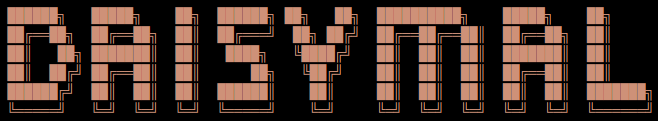

In this repository you can find projects implemented as part of the learning at School 21 (Samarqand city). 

 

C projects :
- P02D13-1-develop - implementation of the Game of Life game
- C2_s21_stringplus-1-develop - implementation of the string.h library with additions
- C3_SimpleBashUtils-1 - development of bash text utilities: cat, grep
- C6_s21_matrix-1 - implementation of the matrix library
- C7_BrickGame_v1.0-1 - implementation of Tetris game

C++ projects :

 

- CPP1_s21_matrixplus-1 - implementation of the matrix library
- CPP2_s21_containers-2 - implementation of the s21_containers.h library

DevOps projects :
- DO2_LinuxNetwork-1 - basic commands for working with networks
- DO5_SimpleDocker-1 - basic commands for working with containers
- DO6_CICD-1-develop - deployment of the SimpleBashUtils project

Python projects :
- APP1_Bootcamp
